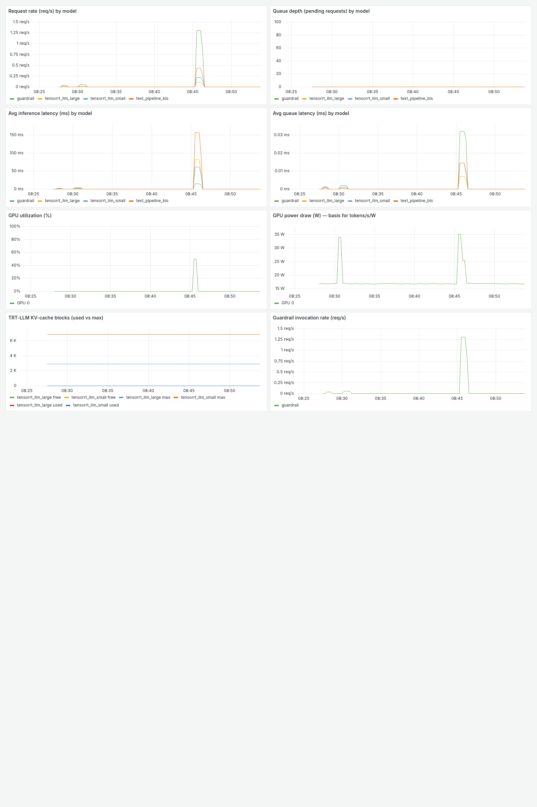

# triton-trtllm-text-io — Architecture & Status Report

*Local bring-up on a single NVIDIA L4 (NGC `tritonserver:24.10-trtllm`, TensorRT-LLM 0.14.0).*
*Companion docs: implementation walkthrough in [`IMPLEMENTATION.md`](./IMPLEMENTATION.md);*
*root-cause analysis of every fix in [`RCA.md`](./RCA.md);*
*guardrail test report with real captured outputs in [`GUARDRAILS.md`](./GUARDRAILS.md).*

---

## 1. What this is

A production-style **LLM inference gateway** on Triton + TensorRT-LLM. A client sends raw chat
`messages` over gRPC and receives a **streamed text** response. The serving layer — not the
client — does routing, input/output guardrails, chat-templating + tokenization, streaming
incremental detokenization, stop handling, and emits metrics + traces. It turns a raw
`token_ids → token_ids` TRT-LLM engine into the endpoint users actually expect.

---

## 2. Architecture

### 2.1 Request flow

```
                         text_pipeline_bls  (BLS gateway, decoupled streaming)
 MESSAGES ─► (1) route ─► (2) input guard ─► (3) chat-template + tokenize
          ─► (4) tensorrt_llm_{small|large}  (decoupled streaming · KV-cache reuse)
          ─► (5) incremental detokenize + cross-token stop
          ─► (6) chunked output guard ─────────────────────► streamed TEXT deltas
        Prometheus :8002   ·   DCGM :9400 (GPU power)   ·   OpenTelemetry traces :4318
```

### 2.2 Models in the repository

| Model | Backend | Role |
|---|---|---|
| `text_pipeline_bls` | python (decoupled) | **The entrypoint.** Orchestrates routing → guard → tokenize → engine → streaming detok → output guard. 2 CPU instances. |
| `guardrail` | python (GPU) | Safety classifier. `MODE=input` → prompt-injection (`deberta-v3-base-prompt-injection-v2`); `MODE=output` → toxicity (`toxic-bert`). Returns `BLOCKED/CATEGORY/SCORE`. |
| `tensorrt_llm_small` | tensorrtllm | Qwen2.5-**0.5B** FP16 engine — the cheap routing target. KV-cache reuse on; `kv_cache_free_gpu_mem_fraction=0.25`. |
| `tensorrt_llm_large` | tensorrtllm | Qwen2.5-**1.5B** FP16 engine — the larger routing target. `kv_cache_free_gpu_mem_fraction=0.45`. |

### 2.3 Key design choices

- **BLS, not an ensemble** — steps (5)/(6) need per-request state (the detok buffer, the
  moderation window) and the ability to stop early; that imperative control flow lives in Python.
- **Single source of truth** — the incremental detok / stop math in `src/text_io/` is imported by
  both the BLS (serving) and the GPU-free unit tests, so live behavior == tested behavior.
- **Co-located guard** — a ~110–184M classifier sits next to the 1.5B LLM, so input moderation can
  short-circuit *before* spending the LLM and output moderation gates the stream in chunks.
- **Routing** — explicit `model` field wins; otherwise a cheap complexity heuristic (prompt length /
  max_tokens) picks small vs large.

### 2.4 Deployment topology (currently running)

| Container | Image | Ports | Purpose |
|---|---|---|---|
| `triton-llm` | `triton-trtllm-text-io:local` | 8000 (HTTP) · 8001 (gRPC) · 8002 (metrics) | The serving stack (4 models) |
| `observability-prometheus-1` | prom/prometheus | 9090 | Scrapes Triton + DCGM + collector |
| `observability-grafana-1` | grafana | 3000 | Dashboards (anonymous admin) |
| `observability-jaeger-1` | jaeger all-in-one | 16686 | Trace UI |
| `observability-otel-collector-1` | otel-collector-contrib | 4317/4318/8889 | OTLP → Jaeger + spanmetrics |
| `observability-dcgm-exporter-1` | dcgm-exporter | 9400 | GPU power / utilization |

**Hardware:** NVIDIA L4 (22.5 GB usable). Engines: `0.5b-fp16` (1.2 GB) + `1.5b-fp16` (3.4 GB),
both FP16 with paged-context FMHA (so KV-cache prefix reuse is available). With both engines +
KV cache + the guard classifier loaded, GPU usage is ~17.9 GB — comfortable headroom.

---

## 3. What has been done

### 3.1 Bring-up
- Cloned `github.com/clark-s-dev/triton-trtllm-text-io`; configured push via PAT in
  `~/.git-credentials` (`credential.helper store`), commit identity `Clark S <shouyuqing@hotmail.com>`.
- Readiness gate (`scripts/check_env.py`) → **READY** (L4, 22.5 GB, driver 580, Docker + NVIDIA toolkit).
- Host env: bootstrapped a venv with pip (system Python 3.12 has none); installed the client deps;
  downloaded Qwen2.5-0.5B + 1.5B (Apache-2.0, ~4 GB).
- Built the custom Triton image and both TRT-LLM engines.

### 3.2 Fixes applied (merged in PR #2 — see `RCA.md` for full root-cause analysis)
1. **Engine build version pairing** — `TRTLLM_REF v0.13.0 → v0.14.0` to match the 24.10 image.
2. **Qwen2.5 tied embeddings** — added `--use_embedding_sharing` (the `None` lm_head crash).
3. **NGC 0.14.0 lib bug** — patched `check_share_embedding()` missing-`config` call in the build container.
4. **Trimmed model configs** — merged the full v0.14 input/output tensor set into the two
   `tensorrt_llm` configs (they declared no I/O and could not load).
5. **Streaming** — yield the per-response token delta directly (the 24.10 backend is not
   cumulative; the old slice dropped every token after the first).
6. **EOS** — pass `end_id` so generation stops at end-of-turn.
7. **Observability** — made mounted configs world-readable (`640`→`o+r`); removed duplicate
   spanmetrics dimensions that crashed the collector.

### 3.3 Validation (all passing on the L4)

| Capability | Result |
|---|---|
| GPU-free unit tests (`make test`) | ✅ streaming detok + stop logic byte-exact |
| Streaming generation | ✅ tokens stream over gRPC |
| Byte-exact CJK + emoji detok | ✅ full Chinese streamed, no `�` mojibake |
| Routing (small / large) | ✅ explicit `--model large` hits the 1.5B engine |
| Cross-token stop sequences | ✅ `"One, two, three, four, "` → `finish_reason: stop` |
| Input guardrail | ✅ prompt-injection → `[blocked: INJECTION]` before the LLM |
| EOS stopping | ✅ short answers end naturally (e.g. "…Paris.") |
| `finish_reason` correctness | ✅ EOS→`stop`, budget→`length`, stop-string→`stop` (RCA §9) |
| Metrics scraping | ✅ Prometheus targets `triton`, `dcgm`, `otel-spanmetrics` all `up` |
| Distributed tracing | ✅ `triton-trtllm-text-io` traces visible in Jaeger |

### 3.4 Monitoring

Grafana **Serving Overview** dashboard (uid `trtllm-text-io`), captured live after a 24-request
mixed-load burst:



Live UIs: Grafana http://localhost:3000 · Prometheus http://localhost:9090 · Jaeger http://localhost:16686

---

## 4. How to operate

```bash
# Talk to the gateway (use the venv — it has tritonclient)
cd ~/triton-trtllm-text-io
.venv/bin/python client/client_fused.py --message "explain KV cache" --model large --max-tokens 128
.venv/bin/python client/client_fused.py --message "用三句话介绍 GPU 推理 🚀"      # CJK + emoji
.venv/bin/python client/client_fused.py --message "count" --stop "five"           # stop sequence

# Lifecycle
docker logs -f triton-llm                 # server logs
docker restart triton-llm                 # reload after editing model.py / configs (volume-mounted)
make obs-down                             # stop the observability stack
```

---

## 5. Known limitations & next steps

**Resolved since the initial bring-up** (full bilingual RCA in [`RCA.md`](./RCA.md) §9–§10):
- **`finish_reason`** now distinguishes a natural EOS stop (`stop`) from budget exhaustion
  (`length`) and stop-strings (`stop`) — the decision is a GPU-free, unit-tested pure function in
  `src/text_io/finish.py`, so live behavior == tested behavior.
- **`src/` is now bind-mounted** (`start_server.sh`) so edits to the single source of truth go live
  on `docker restart`, like `model_repository` — previously it was baked into the image only, and a
  new `text_io` module silently failed to load until an image rebuild.

**Still open:**
- **Guardrail sensitivity** — `deberta-v3` injection classifier over-triggers at threshold 0.5
  (flagged a benign "Reply with exactly…" prompt). Tune `BLOCK_THRESHOLD` or swap in Llama Guard 3.
- **Single L4** — both engines + guard fit (~17.9/22.5 GB), but the co-located CV server
  (`triton-fused`) cannot run simultaneously (shared ports 8000–8002 + VRAM); it is currently stopped.
- **Guard model download** — the classifiers download on first container init; pre-baking them into
  the image (commented hook in the `Dockerfile`) would make first start fast / offline-capable.
