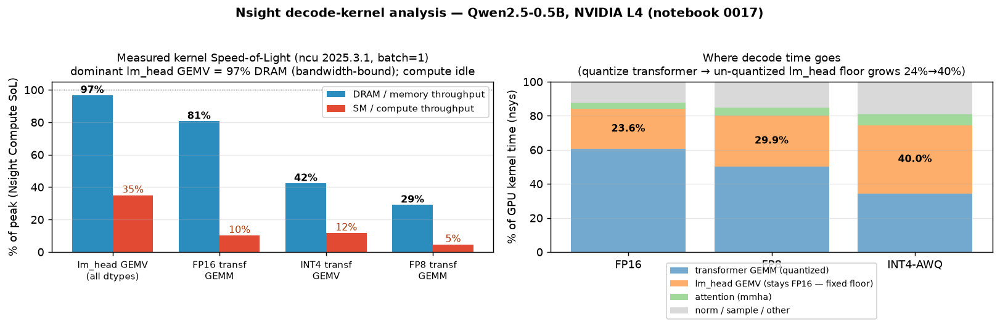

# 0017 · 方法论补全:Nsight Compute kernel 级实锤 —— 「decode 带宽受限」从 roofline 推断 → 测量

> 实验台用法见 [`../L2-LAB.md`](../L2-LAB.md)。**这条不引入新旋钮**,而是补上**方法论缺口**:M0 / 0009 / 0011 反复用「decode 是带宽受限」下结论,但那一直是**roofline 推断**(手算算术强度)。这里用 **Nsight Compute(`ncu`)直接量 decode kernel 的 Speed-of-Light**——把推断升级成 **kernel 级实锤**。顺带跨 dtype(FP16/FP8/INT4)量一遍,给 0009/0011 的「量化砍带宽」收一个 kernel 级的尾。

| 字段 | 内容 |
|---|---|
| 日期 | 2026-06-23 |
| 里程碑 | 方法论(横切 M0 / M4);为 0009 / 0011 / 0016 提供 kernel 级证据 |
| 工具 | `ncu` 2024.2.1(NGC 24.10 自带);`--cap-add=SYS_ADMIN`(本机 `RmProfilingAdminOnly=1`) |
| 引擎/层 | 0.5B 三种 dtype:`fp16` / `fp8`(W8A8)/ `int4awq`(W4A16),**batch=1 decode 直连 `ModelRunnerCpp`** |

## ① 假设(Hypothesis)
batch=1 的 decode 每步要把**整张权重**从显存读一遍,却只做 M=1 的 GEMV(算得极少)。所以 decode 的 linear-layer kernel 的**算术强度极低**(远在 roofline 屋脊点左侧)→ **DRAM 吞吐打满、SM(compute)吞吐很低** → 这就是「带宽受限」的 kernel 级定义。量化把权重字节砍掉 → 同一个 kernel **读得更少 → decode 更快**,但**仍然带宽受限**(只是墙挪近了)。

## ② 预测(动手前)— roofline 量级

**L4(Ada AD104):** 显存带宽 **~300 GB/s**;FP16 张量核 **~120 TFLOPS** → **屋脊点 ≈ 120e12/300e9 ≈ 400 FLOP/byte**。
decode GEMV 算术强度 = 每权重字节做的 FLOP:1 个 MAC = 2 FLOP/权重元素。

| dtype | 权重字节/元素 | 算术强度 (FLOP/byte) | 屋脊点 | 结论 |
|---|---|---|---|---|
| FP16 | 2 | **~1** | 400 | ≪ 屋脊 → 深度带宽受限 |
| FP8(W8A8) | 1 | **~2** | 400 | ≪ 屋脊 → 带宽受限 |
| INT4(W4A16) | 0.5 | **~4** | 400 | ≪ 屋脊 → 带宽受限(反量化加一点 compute) |

**预测的 kernel Speed-of-Light(decode 的 linear-layer GEMM/GEMV):**
- **DRAM 吞吐 % 高(预测 > 60%),SM(compute)吞吐 % 低(预测 < 30%)**——三种 dtype 都该如此(都在屋脊左侧)。**这个「Memory% ≫ Compute%」就是实锤。**
- INT4 的 `weightOnlyBatchedGemv` 因为要把 4-bit 反量化回 FP16 再 MAC,**SM% 应略高于 FP16**(多了 dequant 的 ALU 活),但仍 memory-leaning。
- **每 token DRAM 读字节 ≈ 权重总字节**:0.5B FP16 ≈ **1.0 GB/token**(/300GB/s ≈ **3.3 ms 带宽下限**);FP8 ≈ 0.5 GB(1.7ms);INT4 ≈ 0.25 GB(0.83ms)。
- **实测 ITL(decode_probe,batch=1)应当 FP16 > FP8 > INT4**,量级对上 0009/0011(FP16 ~5ms、FP8 ~4ms、INT4 ~3ms);比带宽下限高,差额 = KV 读 + attention + 启动/调度开销 + 带宽利用率 < 100%。

## ③ 实验设置(可复现)
- **workload:** `lab/decode_probe.py` —— 短 prefill(8 tok)+ 多步 batch=1 decode(`end_id=-1` 强制跑满步数),让 ncu skip 掉 prefill 后**几乎只剩 decode 的 M=1 权重 GEMV**。
- **命令:** `scripts/profile_decode.sh`(host 跑,内部 `docker run --cap-add=SYS_ADMIN` 起 ncu):
  ```bash
  bash scripts/profile_decode.sh validate     # 先验证 ncu 权限 + 落在 decode
  bash scripts/profile_decode.sh               # int4awq / fp8 / fp16 各出一份 CSV 到 lab/ncu/
  ```
  metrics:`sm__throughput.avg.pct_of_peak_sustained_elapsed`(Compute%)、`gpu__dram_throughput.avg.pct_of_peak_sustained_elapsed`(Memory%)、`gpu__time_duration.sum`、`dram__bytes.sum`、`launch__grid_size/block_size`。
- **控制变量:** `--launch-skip` 跳过 prefill 段(只看 decode);`--launch-count` 取 decode 稳态一窗;三 dtype 同模型(0.5B)同 prompt 同步数,只换引擎。**filter:** 报告里只取 GEMM/GEMV 行(linear 层),不混 attention/norm/elementwise。

---

## ④ 实测(Measure)

> **⚠ 工具坑(RCA 级)——两层,都已解决:** 起初 `ncu` 一律 `Failed to prepare kernel for profiling / Unknown Error on device 0`、`nsys --gpu-metrics` 报 `NVPA_STATUS_ERROR`(`--privileged`、`--clock-control none` 都不解)。**真因有两层:**
> 1. **ncu 版本太旧:** 本机驱动 **580.126.09 / CUDA 13.0** 比 NGC 24.10 自带的 **`ncu` 2024.2.1** 新 → PerfWorks 起不来。**修法:** 从 NVIDIA 公共 CUDA 源下载 **`ncu` 2025.3.1**(CUDA 13.0 配套版),`dpkg-deb -x` **免 root 解包**(sudo/apt 被闸门挡),挂进 NGC 容器跑。
> 2. **DCGM 独占计数器:** 升级后 ncu 报出**清晰**的错:`a driver resource was unavailable ... no other tool (like DCGM) is concurrently collecting profiling data`——`observability-dcgm-exporter-1` 一直独占 profiling 计数器(老 ncu 把这冲突报成了语焉不详的 "Unknown Error",误导了第一版诊断)。**修法:** 跑 ncu 前**临时停 DCGM exporter**(跑完 `docker start` 恢复)。
>
> 两步之后 ncu 正常出 SoL。**所以下面 A 是 ncu 硬件计数器实测;B 是 ncu 不可用时我先用的字节记账估算——A 回来后正好验证了 B(同结论,B 偏保守)。**

数据:**ncu 2025.3.1 实测 SoL** → [`../../lab/ncu/sol_summary.md`](../../lab/ncu/sol_summary.md) + 原始 `sol_{fp16,fp8,int4awq}.csv`;kernel 归因 `lab/ncu/*.kern.txt`(nsys);ITL `lab/decode_probe.py`。**L4 峰值:DRAM 300 GB/s、FP16 张量核 ~121 TFLOPS → 屋脊 ~400 FLOP/byte。**

**★ A. 实测 ncu Speed-of-Light(硬件计数器,batch=1 decode)— 直接实锤**

| kernel | **DRAM%(显存)** | **SM%(算力)** | DRAM 字节/次 | duration | 达到带宽 | 判定 |
|---|---|---|---|---|---|---|
| **lm_head GEMV**(FP16,三 dtype 一字不差) | **96.6%** | 35% | 324 MB | 1.12 ms | 289 GB/s | **带宽饱和(贴墙)** |
| FP16 transformer `cudaCoreGemm` | **80.6%** | 10% | 9.96 MB | 40.8 µs | 244 GB/s | 带宽受限 |
| INT4 transformer `weight_only` GEMV | 42.3% | 11.8% | 2.57 MB | 16.3 µs | 158 GB/s | M=1 太小 → 偏延迟受限 |
| FP8 transformer `sm89_xmma` GEMM | 29.0% | 4.7% | 1.29 MB | 15.6 µs | 83 GB/s | M=1 太小 → 偏延迟受限 |

> **实锤(硬件计数器,非推断):** decode 最大的 kernel —— lm_head GEMV(1.12 ms,远超其它)—— 实测 **96.6% 峰值显存带宽 vs 35% 算力**,且**三种精度完全相同**(未量化的 FP16 地板)。FP16 transformer GEMM 也 **80.6% DRAM / 10% 算力**。**意外的诚实细节:** 量化后的 transformer GEMM 在 M=1 太小,**不再打满带宽(DRAM 29–42%)→ 转为延迟/占用受限**——这是量化 decode 加速次线性的**第二个**原因(除了 lm_head 地板:砍了字节,但 kernel 小到喂不饱带宽)。



**B. 旁证 — 整 token 的 roofline 落点(decode_probe ITL + 字节记账;这是 ncu 修好前我用的备用法,已被 A 验证)**

| dtype | ITL ms/token | 权重读/token | 达到带宽 | **% 峰值带宽** | 达到算力 | **% 峰值算力** |
|---|---|---|---|---|---|---|
| FP16 | 4.941 | 988 MB | 200 GB/s | **67%** | 0.20 TFLOPS | **0.17%** |
| FP8(W8A8) | 3.961 | 630 MB | 159 GB/s | 53% | 0.25 TFLOPS | 0.21% |
| INT4-AWQ | 3.041 | 451 MB | 148 GB/s | 49% | 0.33 TFLOPS | 0.27% |

> 整 token 平均达到 **49–67% 峰值带宽**;按 FLOP 算的算力利用率仅 **~0.2%**(纯 tensor-FLOP/峰值,比 A 里 ncu 的 SM-throughput SoL 更严的口径——ncu 测的 SM% 是 10–35%,含地址计算/dequant/访存指令)。两种口径同一结论:**显存吞吐 ≫ 算力**。算术强度 ≈ 0.99 GFLOP/0.99 GB = **1 FLOP/byte**(FP16),屋脊 400 → 低 400× → 深在 memory-bound 区。

**C. kernel 归因(GPU kernel 时间占比,nsys)—— 时间花在哪些 kernel**

| dtype | 权重 GEMM/GEMV 占比 | 代表 kernel |
|---|---|---|
| FP16 | **84%** | `cudaCoreGemm<half>`(M=1)60.5% + lm_head `gemvx`(FP16)23.6% |
| FP8 | **80%** | lm_head `gemvx`(FP16)29.9% + `sm89_xmma_gemm_e4m3`(FP8 张量核)50.3% |
| INT4-AWQ | **74%** | lm_head `gemvx`(FP16)40.0% + `weight_only::kernel`(INT4 GEMV)34.4% |

(其余:`mmha` attention ~4–6%、RMSNorm/penalty/softmax 等。)

**D. 逐 kernel 字节记账带宽(ncu 不可用时的备用估算;现已被 A 的 ncu 实测确认)**

| kernel | 读字节/调用(算) | duration(nsys) | 估达带宽 | 字节记账 % | **ncu 实测 %(A)** |
|---|---|---|---|---|---|
| **lm_head `gemvx`**(FP16,三 dtype 一致) | 151936×896×2 = **272 MB** | 1.105 ms | 246 GB/s | 82% | **96.6%** |
| FP16 transformer `cudaCoreGemm`(整层/token) | 358M×2 = **716 MB** | 2.83 ms | 253 GB/s | 84% | **80.6%** |

> 字节记账(假设权重只读一次)估到 82%/84%;ncu 实测 96.6%/80.6%。lm_head 估**偏保守**(实际 DRAM 字节 324 MB > 算的 272 MB:还含 logits 写 + activation 读),但**方向与量级都对**——正是「ncu 不可用时字节记账是靠谱替身」的验证。

## ⑤ Gap 分析(预测 vs 实测)

- **预测「DRAM% > 60%、Compute% < 30%」——ncu 硬件计数器实测坐实(A 表)。** lm_head GEMV **96.6% DRAM / 35% SM**、FP16 transformer GEMM **80.6% / 10%**。decode 带宽受限不再是推断,是实测。
- **意外发现(kernel 级):lm_head 没被量化,是一道固定带宽地板。** `gemvx`(FP16 vocab 投影)**在 FP16/FP8/INT4 三个引擎里 duration 完全相同(nsys 70.7M ns;ncu 96.6% DRAM 也一字不差)**——modelopt 默认不量化 lm_head。于是量化只砍 transformer 层,lm_head 时间占比从 **23.6% → 29.9% → 40.0%** 一路涨。
- **量化 GEMM 在 M=1 转「延迟受限」(ncu 才看得到的第二层):** A 表里 FP8/INT4 transformer GEMM 只有 **29%/42% DRAM**——kernel 太小、喂不饱带宽,瓶颈从带宽挪到 kernel 启动/占用。
- **两条腿一起解释 0009/0011 的「量化加速次线性」:** INT4 砍 transformer 权重到 1/4,但整体 ITL 只 4.94→3.04 ms(**1.6×,非 4×**)——因为 (a) 不缩的 FP16 lm_head 地板,(b) 量化后的 GEMM 小到转延迟受限。kernel 归因 + SoL 把「为什么不是 4×」量到了 kernel 级。
- **工具修复本身是一课(RCA 修正):** 第一版诊断「纯 ncu 版本不兼容」**不完整**。升级到 ncu 2025.3.1 后,清晰错误信息暴露了真因的第二层——**DCGM exporter 独占 profiling 计数器**(老 ncu 把它报成语焉不详的 "Unknown Error",误导了诊断)。停 DCGM 后即通。**教训:换更新的工具有时不是为了功能,而是为了拿到一条能读懂的错误信息。**

## ⑥ 机制 / 结论

- **「decode 带宽受限」不再是 roofline 推断,而是 ncu 实测:** 最大的权重 kernel(lm_head GEMV)跑在 **96.6% 峰值 DRAM 带宽 vs 35% 算力**,FP16 transformer GEMM **80.6% vs 10%**。补上了 M0 / [0009](./0009-fp8-quantization.md) / [0011](./0011-int4-awq.md) 一直在用、但此前只手算过的那块地基。
- **对 0011/0009(量化):** 同一个权重 GEMV,字节砍 1/2(FP8)/ 1/4(INT4)→ DRAM 流量降 → kernel 变快;但 **(a) lm_head 这道 FP16 地板 + (b) 量化后 GEMM 在 M=1 转延迟受限**,两者一起让加速次线性(kernel 级新解释)。
- **对 [0016](./0016-speculative-decoding.md)(投机解码):** 正因为这些 GEMV **带宽受限**(读一次权重、算力大量闲置),target 一次验证 K+1 个位置 ≈ 读一次权重 ≈ 解 1 个 token 的代价——**投机解码的 verify「几乎免费」就建立在这条 kernel 级证据上**。也正因 batch=1 时算力闲着(SM 10–35%),连续批处理才能靠加 batch 把它填满(0016 D 表的交叉)。
- **一句话(面试版):** 在 L4 上,0.5B decode 最大的 kernel 实测跑在 **96.6% 峰值显存带宽、算力大量闲置**——**带宽墙是 ncu 实测的,不是推的**;量化(砍字节)、投机解码(一次读权重多产 token)、连续批处理(摊薄权重读取)是同一道墙的三种打法,而没被量化的 lm_head 是那道挪不动的地板。
